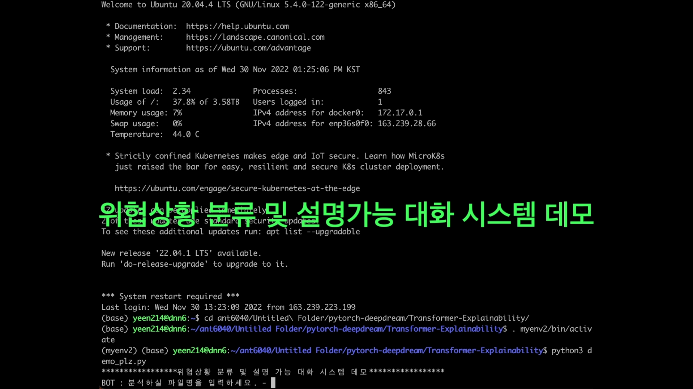
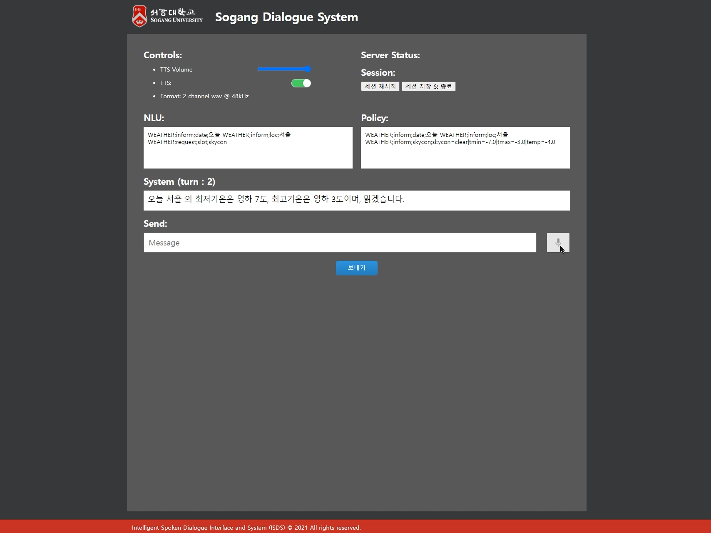
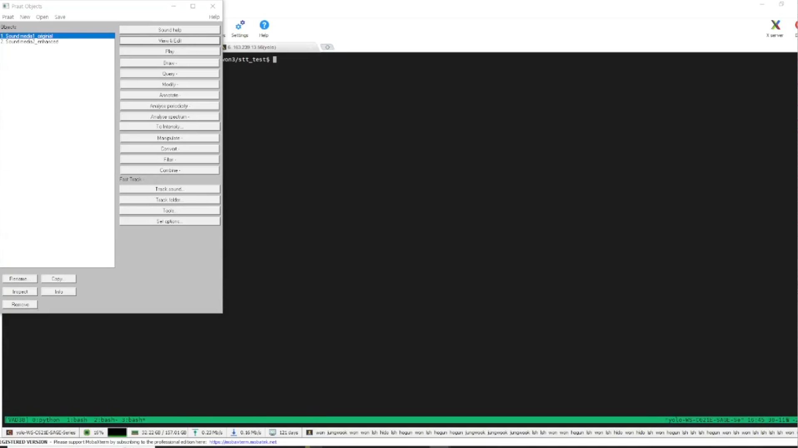

#  대화 기반 설명가능성을 멀티모달로 제공하는 인공지능 기술 개발

본 프로젝트는 대화 기반의 Explainable AI를 개발하는 것을 목표로 하며, 최종적으로는 설명가능성 기술을 멀티모달리티로 제공하고자 함.

## 연구 개요
인공지능의 예측 결과에 대한 사용자 맞춤형 설명이 제공되는 설명가능한 인공지능의 필요성 증대되고 있음. 특히, 결과 신뢰도 향상을 위한 설명가능한 인공지능(XAI)이 이러한 문제를 해결해 줄 수 있을 것으로 기대되고 있음. 

본 프로젝트에서는 의료 및 법률 분야에서의 사용자 수준별 맞춤형 설명이 가능한 대화형 인터페이스 기반 설명 모드 기술을 개발하고자 함.

## 데이터

- 의료 XAI 데이터
- 법률 XAI 데이터

## 시연영상

### 법률분야 위협상황 분류 XAI visualization 시연

### 대화기반 설명가능성을 위한 음성대화 시스템 베이스라인 시연

### 음성 향상을 통한 formant 분석 시연

## Copyright

본 프로젝트의 저작권은 서강대학교 [지능형 음성대화 인터페이스 연구실](https://isds.sogang.ac.kr/)에 있습니다.